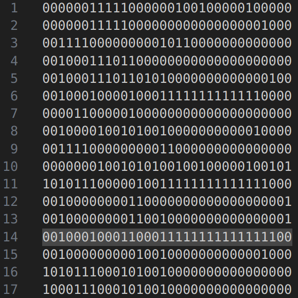
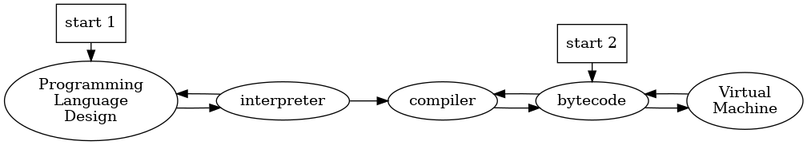
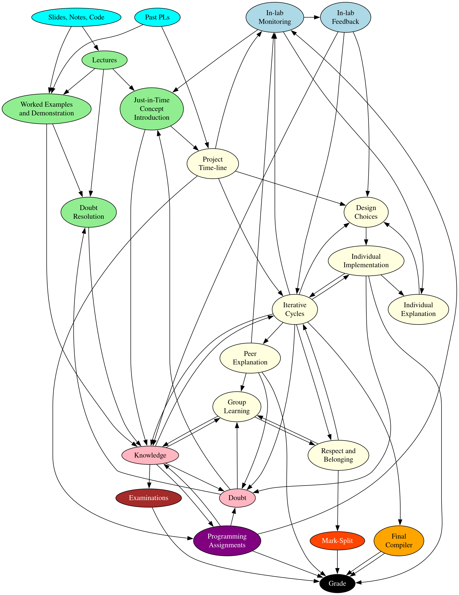

## Learning Goals

### Domain Background

Programming languages (PL) such as Python, C, Java, etc. are high-level languages (HLL). 

{height=200px}

Code written in an HLL is either interpreted and executed immediately or is converted to a lower-level language consisting of instructions called bytecode. Optionally, it might be first converted to assembly code (e.g. MIPS) and then assembled into bytecode.

{height=200px}

{height=200px}

{height=200px}

A compiler is a program that converts code written in an HLL into bytecode. An interpreter is a program that executes HLL code without conversion to bytecode. A virtual machine executes the bytecode.

{height=100px}

Learning to create interpreters and compilers for PLs allows crafting custom PLs. While the set of possible PLs that can be interpreted is very large, the set of PLs that can be "sanely" compiled and can be used for general-purpose tasks and provide intuitive and necessary features is much smaller. Thus, PL design is an important task, and the theories used to design "good" PLs are collectively known as PL theory.

### Course Context

This course, CS 327, is a CSE elective that falls into the computer systems basket and is aimed at students who plan to pursue careers in industry, where understanding compiler design and systems programming is increasingly valuable.

### Professor's goals

> My primary motivation is to convey the beauty of the subject, get students interested, and then getting them to work on a large-ish codebase. This would be common to many of the systems courses if I teach them: compilers, os, networks, etc.. Problems that pop-up when developing in the large (with multiple people, spanning non-trivial time period) can only be really understood while writing large programs yourself. I think in Computing, DSAx, etc., there are no opportunities to do this. Main technical objectives are teaching lexing + parsing (a task that pops up almost everywhere in programming) and to expose students to some aspects of engineering with language design as a medium (types, mutability, first-class vs second-class).

From this, some goals can be identified:

- Convey the beauty of the subject and Get students interested : intrinsic motivation
- working with large codebases, exposure to tradeoffs in engineering, and skills (lexing,parsing) that "pop up everywhere" : competence in _real life contexts_ (effective transfer)

### Domain Knowledge:

While the goals articulated by the professor shed light on some domain knowledge. The actual things learnt and evaluated is more extensive. I am listing some major components.

- Understanding of basic PL theory
- Knowledge of interpreter and compiler design
- Mastery over intermediate stages such as lexing and parsing
- Understanding of VM and bytecode
- Practical ability to write code for interpreters and compilers in a HLL
- Ability to work with large code-bases

### Control Strategies (soft skills):

- Teamwork and efficient distribution of work to accelerate product development
- Time management (over long time-frames)
- Managing the trade-off between usability/practicality and creative implementation (interest)

### Students' Goals

In discussions with peers, I discovered diverse motivations for taking the course. Here I list a few:

- Industry relevance: Compilers and computer systems skills are in-demand in the software development market.
- Career incentives: Some classmates had secured internships at companies like Qualcomm with roles centered around compilers.
- Research interest: One teammate was conducting research in PL theory; this course was a natural continuation.
- Challenge and growth: Some students (including myself) had heard the course was challenging and saw taking it as central to becoming a strong computer engineer.

### Overarching Career-Oriented Goal:

Given the goals of the students, a primary goal should be enabling students to actually take on compiler-related tasks in their future careers and possess the genuine competence needed to finish them successfully. To accomplish the former, students need a sense of competence (confidence) and authentic interest in the domain. The same is visible in the professor's goals.

Thus, the core metrics that the students should improve on are:

- **Actual competence** : the ability to design and implement compilers in real-life contexts
- **Sense of competence** : confidence in ability to work on compilers
- **Genuine interest** : intrinsic motivation beyond course grades after seeing the "beauty of the subject"

\newpage

## Learning Design and Features

### Structuring Through Sequential Implementation Pipeline

The course imposed a logical sequence on project work.

{height=200px}

This structure prevented chaotic, simultaneous attempts at multiple implementation strategies. Instead, students focused on one stage at a time, building competence sequentially.

\newpage

### Assessment Weightage and Incentive Structure

The grading scheme heavily emphasized practical work over theoretical testing. Examinations received only 20% of the final grade, programming assignments received 30%, and the course project received the remainder (50%), fundamentally shaping student effort allocation.
The group project allowed for group learning, bricolage, and style development but by itself, didn't facilitate doubt resolution.

{height=300px}

### Learning Through Peer Examination

Student teams examined each other's PL designs and compiler approaches, using insights from peers to refine their own work. This created a some-what active community of practice where students were both learners and resources for one another.

\newpage

### Lecture Structure

The lectures served both as doubt-resolution sessions where ongoing compiler work was discussed, and for introducing new concepts when they became useful to students' current work. For example, the cactus-stack data structure used for implementing function closures, was taught only after students had already begun implementing functions in their projects. This just-in-time scaffolding prevented cognitive overload while maintaining authentic need for the knowledge being taught. There was no grading based on lecture attendance; students were only expected to stay current with concepts introduced during lectures.

{height=300px}

\newpage

### One-on-One Monitoring and Adaptive Feedback Through Lab Sessions

Lab sessions featured one-on-one discussions between students and TAs. These sessions were explicitly framed as monitoring scaffolds; forums for providing personalized guidance and feedback rather than for grading performance. This qualitative monitoring allowed the professor to provide adaptive feedback based on the teams' progress and challenges, similar to scrum meetings in industry or research lab sessions.

{height=300px}

\newpage

### Theoretical Examination

Evaluation through the project suffers through plagiarism and excess reliance on AI. Thus, they are not sufficient to check the actual learning. Keeping a theoretical exam on a minimal set of topics that were (almost necessarily) learnt through the project solves this.

### Fair Mark Distribution and Social Accountability

The course implemented a solution to the negative episodes (related to the practice of teamwork) caused due to the "freeloader problem" during evaluation, common in group projects: rather than assigning identical marks to all team members, the total marks for the project were given to the team, and team members negotiated and justified the distribution of marks to the professor. Critically, this rule was announced only at the end of the semester; had it been explicit from the start, it would have created unhealthy competition and discouraged team formation.  

{height=300px}

\newpage

### Programming assignments for Breadth of knowledge

While the project allows for deep internalisation and appreciation of a few useful concepts, it doesn't give a breadth of knowledge. This is solved by the programming assignments which are on a variety of topics. Moreover, because the assignments are much easier and mostly independent of the project, any weak student can gain new skills at any given stage in the project timeline and start contributing using these skills because of his/her comparative advantage. Thus, the "under-employed worker" problem is partially solved here.

{height=300px}

\newpage

### Other resources serving as worked examples

All course materials such as slides, notes, code, and relevant links were written on a page in a GitHub repository.
At the top of the page, the professor explicitly stated:

> There is no textbook. Follow the lectures. Code a lot. Read necessary theory.

On the first day of the course, students were shown the PL designs built by teams in the previous year, providing concrete models of what successful final products could look like.

The code and pseudocode on the GitHub repository served as worked examples along with demonstrations done during lectures. This avoided a lot of confusion and anxiety that the student might have experienced if unguided.

{height=400px}

\newpage

## Learning Theories or Pedagogical Models Used

### Constructionism

Constructionism posits that learning occurs most powerfully when learners design, build, and refine tangible, meaningful artifacts in the world. 

Evidence of constructionist learning can be seen from the course outcomes: by the end of the semester, I had learned nearly every concept required for the final written exam while referring to no written sources and attending only about half the lectures. The learning happened primarily through the project and assignments, not through instruction.

Learning followed a bricolage model, characteristic of authentic programming work. I would design or implement a feature, observe the restrictions and benefits that the feature provided after implementation, and based on that observation, either add another feature or improve the existing implementation.

### Cognitive Apprenticeship

Cognitive apprenticeship, articulated by Collins, Brown, and Newman, describes how learners acquire complex skills through observation, guided practice, and progressively increased responsibility within an authentic domain. The course exhibits these components of cognitive apprenticeship:

- Global Before Local (Modeling at Scale) : On the first day, students were shown complete PL implementations from previous years.
- Modeling Through Worked Examples : Code and pseudocode for basic tasks
- Scaffolding
  - Timely adaptive help through monitoring in lab and concept introduction based on that
  - Structuring via the implementation pipeline (basic design, interpreter, bytecode, VM cycle)
- Articulation Through Lab Sessions

### Cultural Learning Pathways

Beyond immediate course knowledge, both constructionist and apprenticeship approaches operate within the broader framework of cultural learning pathways. This perspective views the course not as an isolated event but as an episode within each student's trajectory toward becoming a competent compiler engineer or systems programmer.

The course design respects and cultivates these diverse entry points. By producing genuine competence and belonging, not just grades, it creates positive episodes that shape long-term trajectories. My own experience illustrates this: the course's success led me to ideate a new independent project (creating a parser for Oracle SQL).

### Collaborative Learning

This view sees collaboration as not just cooperation (divison of labour) but a to-and-fro between the participants; leading to conflict, grounding (creation of a common ground), negotiation of views and ultimately internalisation of knowledge.

By having the project be done in groups, the course tries to employ "collaboration" as a mechanism for learning. 

\newpage

## Assessment of Learning Theory or Pedagogical Model

The theories employed in the design of this course have these benefits :

1. Constructionism supports development of style and a sense of ownership which leads to **idenity formation**.
2. Cognitive apprenticeship supports both **domain knowledge** and **meta-cognitive skills** through scaffolded, guided practice leading to practical competency **without overwhelming** the students as Sweller warns against.
3. The course creates a positive episode moves the students upwards in the cutural learning path by giving them a **sense of competence**. This "good episode" occurs mainly because of the constructionist approach which is known to be "fun" and often leaves the creator proud of his creation.

A comparative analysis of alternative pedagogical paradigms reveals that while many excel in some dimensions, only the combination of constructionism and cognitive apprenticeship produces all three critical outcomes for the over-arching career-oriented goals simultaneously (competence, sense of competence, and idenity formation) :

- Behaviorism and traditional instructionism produce procedural competence but lack motivation and ownership. Students can execute procedures but don't develop identity or genuine interest.
- Cognitivism based instructionism supports mental model development but can remain abstract and disconnected from authentic practice, limiting transfer and motivation.
- Discovery learning can produce motivation but risks leaving critical conceptual gaps, especially in a domain as complex as compilers, thus not preparing the students for future.
- Problem-based learning engages students but often involves episodic problems rather than sustained artifact development, limiting the sense of ownership and long-term trajectory effects that come from building something persistent.
- Situated learning can overwhelm students with authentic complexity before they have sufficient schemas as Sweller warns about.
- Cognitive apprenticeship alone, while effective for competence development, doesn't necessarily produce the sense of ownership and identity from having built something personally meaningful.

As for collaborative learning, although there was grouping, it didn't necessarily lead to collaboration between _all_ team-members, as was the case of my team. Even through I was lucky and reaped the benefits of timely guidance from a PL theory expert in the team, this is most likely a rare scenario. Thus the course failed to correctly apply the principles in collaborative learning. This is discussed in detail in the "design gaps" subsection.
Moreover, the reason for have the project be done in groups and the specific group size is unclear. It doesn't lead to any significant advantages in my opinion.

\newpage

## Evaluation of Learning Design

### Merits

#### Industry-level knowledge without abstraction overload:

The course operates on the implementable subset of PL and compiler theory, not the abstract formalism. This prevents cognitive overload from unnecessary theory. In contrast, the traditional format introduces full compiler theory, which many students find overwhelming and abstract.

#### Meaningfulness of knowledge throughout the learning process:

In this course, knowledge was learned because it was needed to solve authentic problems. I was able to learn nearly every concept required for the final exam purely through working on the project under guidance of the professor, TAs, and peers. 
In contrast, students in the traditional lecture-based format often experience knowledge as abstract and disconnected from practice, reducing motivation.

#### Excellent sequencing and scaffolding and Appropriate complexity:

In many other CS courses, students receive vague project descriptions and must independently navigate literature review, design decisions, and implementation, or the projects have too high a complexity at the student's level. This often leads to overwhelm, shortcuts, plagiarism, and failure to develop confidence. This course provided careful scaffolding at each stage and avoids overload.

#### Alignment between assessment practices and domain practices:

Exams, assignments, and projects all relied on the same underlying domain knowledge, with minimal emphasis on exam-specific heuristics or strategies. Success in the project strongly predicted success on the exam, creating intrinsic motivation rather than forcing students to juggle disconnected skill sets.

#### Meaningful lab sessions:

The term "lab" is often used synonymously with "test", namely sessions where disconnected skills are graded. This course's labs functioned more like industry scrum meetings or research lab sessions: qualitative monitoring of progress for adaptive feedback rather than grading disconnected skills.

#### Fair evaluation of contribution:

The mark-splitting approach solved the free-loader problem during assessment while preserving motivation for teamwork. A team-mate who had done minimal work was upset when this rule was announced; I, having done roughly 70% of the work, was satisfied. Moreover my teammates were the ones who suggested I get a bigger fraction, signifying that they respected me. Thus the mark-split method evaluates not just the output of the team, but the perceived individual output.

\newpage

### Design Gaps

#### Meaningless Programming Assignments:

While the programming assignments introduced students to many different things, they were not directly related to the project and sometimes felt meaningless.

#### The Underemployed Worker Problem:

Students perceived as less competent by their team were not assigned challenging tasks and consequently contributed less, developed lower perceived competence, and potentially suffered negative learning episodes. Whereas students who did most of the work were overloaded and resented the ones who couldn't contribute.

This problem can be traced back to bad grounding and division of labour by the team at the start. 

Teamwork is an important skill for the future activity systems that the students might enter and must also be _taught_ or at-least be done by the course itself. This course fails to do both and might cause negative episodes in terms of the "teamwork" practice.

According to the collaborative learning theory, by structuring the assignment of roles, we can avoid vertical division of labour (which leads to assymetry in actions); unequal division of labour leading to higher or lower "status" of the student in the eyes of the team; and the extraneous load that comes from managing team dynamics.

Moreover, since we want collaboration and not mere cooperation, we need frequent shuffling of the roles.

We also need the collaboration component to happen synchronously (preferably face-to-face) so that the team members may be able to see externalisations of each other's schemas (say, while speaking), and not just the end product (a written paragraph or some simple statement with no reasoning visible) like we often see in asynchronous media such as WhatsApp or G-mail. 

#### The Lack of Breadth Problem:

The constructionist approach is excellent for practical competency but not so much for gaining a wider range of knowledge.
The breadth of material covered was narrower than traditional courses. For example, recursive descent parsing was thoroughly taught since it was used a lot, but alternatives such as LR or RR parsing were never touched.

\newpage

## Redesign Features

### Group based on forms filled out by students

While the multi-voicedness of the team leads to a variety of approaches and conflict, which leads to collaborative learning, it can also cause disagreements. So, have the students fill out a form with questions such as "what programming langauges are you comfortable with", "have you built a parser before", etc. and then let a computer program form groups, or let the students see the responses and decide amongst themselves.

### Mutiple Implementations of Compiler Pipeline Stages

Each team-member should implement a different approach or component for each pipeline stage. For example, one member could implement a register-based bytecode and VM while another implements a stack-based VM.

Students can be graded with some weightage for their own implemention and some for the final compiler that the team will present using the mark-split method. This avoids the free-rider problem.

Have the students explain their own approach on odd numbered lab sessions and the approach of one other team-mate on the even numbered lab sessions. For the later, give 30 min of time to the team just to converse and prepare. The peer explanations can further be graded at the team level, forcing collaboration.

Benefits include:

- Easier distribution of workload resolving the under-employed worker problem via structuring of role assignment
- Exposure to a wider range of concepts and design trade-offs resolving the Lack of Breadth problem
- Opportunities for conflict, grounding and negotiation among team members.

Since this feature already solves a lot of the issues that the programming assignments were meant to solve, we can remove programming assignments, thereby avoiding the "meaningless assignments" problem entirely.

### Extra Literature for Breadth

- Introduce "see also" sections covering ommited concepts.
- Keep these optional to preserve instrumentality. Students will be motivated to read these either as they face implementation choices requiring each method's understanding or due to curiosity, and will undergo exploration.
- The final exam should only include concepts covered by approaches implemented by teams.
- Additionally, students can be asked to justify their chosen methods in a brief assignment (around 3% weightage), encouraging lightweight engagement with broader literature despite some initial resistance

\newpage 

### New design at a glance

{height=600}
